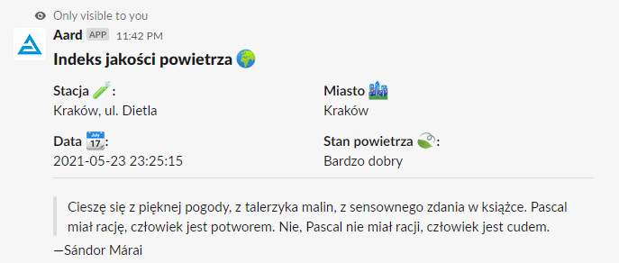
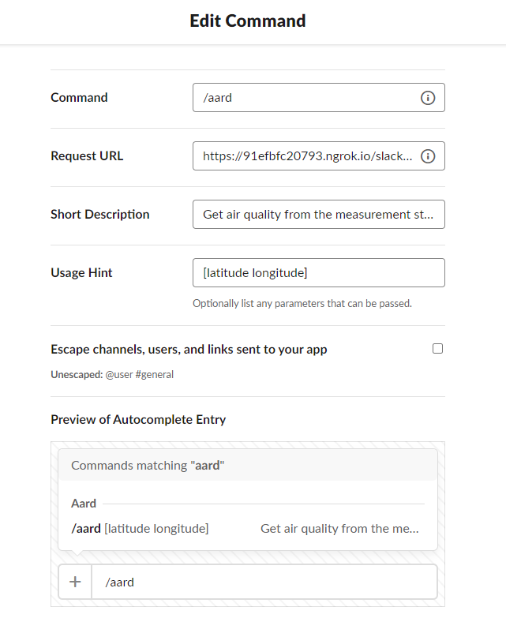

# Nowy Narakort
**Nowy Narakort** is a Slack bot which will check air pollution levels near the place you live in (Poland only). This bot is WIP and is not publicly available.

*Disclaimer*: Public distribution of the Slack bot is a complicated process and requires some additional work which is not yet completed. One of the easiest ways to test the bot is to get invite to my private Slack server.

## Local Setup
In order to run local instance of a bot you need to:
* Build and run Docker image locally
* Expose local bot instance with ngrok using `ngrok http 3000`
* Configure your own bot application following [this](https://slack.com/intl/en-gb/help/articles/115005265703-Create-a-bot-for-your-workspace#add-a-bot-user) tutorial. 
* Create `.env` file (ignored by Git) using `.env.sample` as template anf put there `SLACK_BOT_TOKEN` and `SLACK_SIGNING_SECRET`
* Configure slash command (use picture below as reference:
  - Command: `/aard`
  - Request URL: `{{Ngrok URL}}/slack/events`, e.g. `https://91efbfc20793.ngrok.io/slack/events`
* Add bot to your server and then to the required channel

## Usage
Bot accepts a single command in format `/aard [latitude longitude]`. Both parameters are mandatory and are expected to be real numbers, e.g. `/aard 52.232222 21.008333`
